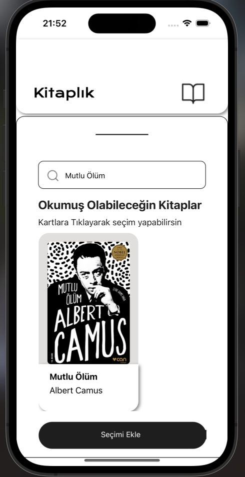

# BookApp-Case

Welcome to my BookApp project. This project was made upon request. You can search for books in the project, select books and add them to your library.

### Installation

1. Clone the repository:

   `git clone https://github.com/Melihomac/BookApp-Case.git   `

   npm install
   or
   yarn install

2. Go to Root and create a folder name `backend`:

   `git clone https://github.com/Melihomac/BookApp-Backend   `

   node app.js

### Usage

1.  `npm start`

### Folder Structure

1. For FrontEnd:

   ```
   ├───assets
   │   │   adaptive-icon.png
   │   │   Cover.png
   │   │   favicon.png
   │   │   icon.png
   │   │   splash.png
   │   ├───fonts
   │   │       FamiljenGrotesk-VariableFont_wght.ttf
   │   │       KronaOne-Regular.ttf
   │   └───icons
   │       │   CardButtonIcons.png
   │       │   LibraryIcon.png
   │       │   plusIcon.png
   │       │   RoundedButtons.png
   │       └───BottomButtons
   │               HomeIcon.png
   │               LibraryActive.png
   │               LibraryButton.png
   │               ProfileButton.png
   │               SearchButton.png
   ├───components
   │   │   Home.tsx
   │   │   Library.tsx
   │   ├───bookReviews
   │   │       BookReviews.tsx
   │   ├───bottomSheet
   │   │       BottomSheetComponent.tsx
   │   ├───header
   │   │       MainHeader.tsx
   │   ├───hook
   │   │       useHook.tsx
   │   ├───myBooks
   │   │       MyBooks.tsx
   │   ├───nowReading
   │   │       NowReading.tsx
   │   └───search
   │           SearchComponent.tsx
   ├───scaleProps
   │       ScaleProps.tsx
   │
   │   .gitignore
   │   app.json
   │   App.tsx
   │   babel.config.js
   │   FirebaseConfig.tsx
   │   package-lock.json
   │   package.json
   │   README.md
   │   tsconfig.json
   │   yarn.lock
   ```

2. For Backend:

   ```
   backend/
   |-- node_modules/
   |-- assets/
   |-- app.js
   |-- data.json
   |-- package.json
   |-- .gitignore
   ```

3. All Structure:

   ```
   case/
   |  -- Files.../
   backend/
   |  -- Files.../
   ```

### Firebase Configurations

1. Create FirebaseProject
2. Create FirebaseConfig.tsx file on your project root folder

3. Add this code to your FirebaseConfig.tsx

   ```JS
   import { initializeApp } from "firebase/app";
   import { getDatabase } from "firebase/database";

   const firebaseConfig = {
   //YOUR CREDENTİALS
   };

   // Initialize Firebase
   const app = initializeApp(firebaseConfig);
   export const db = getDatabase(app);
   ```

4. Create Realtime Database on your firebase console.

---

# ScreenShots

## Library Review


## Add Books


## Add Books 2



## Book Added


